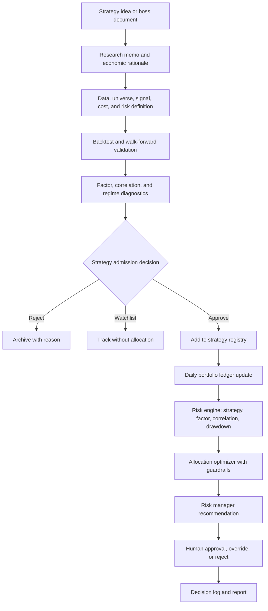

# Platform Workflow Reset

Created: 2026-06-05

## Purpose

This platform should follow the latest risk manager platform mindset while preserving the useful discipline from the earlier live strategy workflow.

The old workflow was useful because it emphasized market monitoring, data validation, macro regime awareness, factor risk, backtesting, walk-forward testing, and human review. The new platform should keep those strengths, but the center of gravity is different now:

```text
Old center: after-market risk monitor and strategy dashboard
New center: multi-strategy risk manager operating system
```

The platform is not just showing what happened. It should help a risk manager decide what to approve, reject, reduce, pause, hedge, rebalance, or keep under explicit evidence and risk constraints.

## What To Keep From The Old Live Strategy Workflow

Keep these because they are still professional and defensible:

| Old Workflow Strength | Why It Still Matters |
|---|---|
| Daily market and macro monitor | The risk manager needs market context before judging strategy behavior |
| Data quality and timestamp alignment | Bad data can create false risk alerts and false strategy signals |
| Factor risk decomposition | Strategy PnL must be explained by economically meaningful exposures |
| Macro regime classification | Some strategy losses are normal regime headwinds, not strategy failure |
| News and event risk awareness | Political, policy, credit, and liquidity events can change next-day risk |
| Long-history backtesting | No strategy should be recommended without historical evidence |
| Walk-forward validation | Helps reduce overfitting and tests whether parameters survive out-of-sample |
| Human review | The system proposes actions; it does not authorize real trades |

These are not the old project's limitations. They are reusable standards.

## What To Change In The New Risk Manager Platform

The new platform should not be organized around one active strategy, one dashboard story, or one daily market view. It should be organized around portfolio-level decision governance.

| Area | Old Workflow | New Platform Mindset |
|---|---|---|
| Main question | What happened today, and what should we watch tomorrow? | Which strategies deserve capital under current risk, evidence, and constraints? |
| Strategy model | Strategy library and candidate switches | 20-40 simultaneous strategies with lifecycle status |
| Allocation | Suggested actions from regime/risk triggers | Current vs proposed weights, cost impact, risk impact, and approval log |
| Risk view | Portfolio and factor monitoring | Strategy, factor, portfolio, correlation, and allocation risk combined |
| Backtesting | Evidence for individual strategy/sleeve | Admission gate for strategy registry and allocation eligibility |
| Dashboard role | Display market/risk/strategy state | Workstation for review, approval, override, and decision documentation |
| Output | After-market memo | Decision-ready risk report plus allocation/rebalance recommendation |

## New Operating Model



## Strategy Lifecycle

Every strategy should have one explicit lifecycle status:

| Status | Meaning |
|---|---|
| idea | Interesting concept, not tested |
| research | Data and signal definition in progress |
| candidate | Backtest exists, pending robustness and risk review |
| approved | Passed admission gates and can receive allocation |
| active | Has current capital allocation and daily monitoring |
| watch | Warning signs exist; allocation should be capped or reviewed |
| paused | Temporarily disabled due to data, risk, or signal concern |
| retired | Removed from active consideration |

This lifecycle is the bridge between research and capital allocation. A strategy should not jump from "interesting idea" directly to "active allocation."

## Strategy Admission Gates

Before a strategy becomes approved or active, it must pass these gates:

1. Economic rationale: explain why the edge should exist.
2. Data validation: define source, timestamp, missing data, and history length.
3. Signal definition: exact formula, timing, and rebalance rule.
4. Cost-aware backtest: include 5 bps buy cost and 5 bps sell cost.
5. Walk-forward validation: store train/test windows and out-of-sample results.
6. Risk diagnostics: Sharpe, volatility, drawdown, VaR/ES where applicable, turnover, and cost drag.
7. Factor diagnostics: equity beta, rates, credit, inflation, volatility, USD, commodity, and sector/style exposures.
8. Correlation diagnostics: overlap with existing active strategies.
9. Regime diagnostics: identify where the strategy is expected to work or fail.
10. Risk limits and failure modes: define reduce, pause, and retire conditions.

## Allocation Decision Philosophy

The allocation engine should not ask only:

```text
Which strategy had the highest Sharpe?
```

It should ask:

```text
Which combination of strategies creates the best risk-managed portfolio
after transaction costs, drawdown, correlation, factor concentration,
regime fit, and human constraints?
```

Allocation recommendations should compare:

- Current weight vs proposed weight.
- Dollar change.
- Estimated transaction cost.
- Change in portfolio Sharpe.
- Change in volatility, VaR, Expected Shortfall, and drawdown risk.
- Change in factor concentration.
- Change in strategy correlation and diversification.
- Reason code for the recommendation.
- Human approval requirement.

## Drawdown And Losing Strategy Policy

The platform should never allocate more capital to a losing strategy simply because it is down. A losing strategy must first be classified:

| Classification | Interpretation | Typical Decision |
|---|---|---|
| Normal drawdown | Loss is within historical behavior and strategy logic still holds | Keep or modestly rebalance |
| Regime headwind | Strategy is losing in a regime where it is expected to struggle | Cap, reduce, or keep as diversifier |
| Risk concentration | Strategy increases unwanted factor or correlation exposure | Reduce or hedge |
| Cost decay | Gross return exists but net return is eaten by turnover/costs | Redesign or reduce |
| Signal decay | IC, hit rate, or live behavior no longer matches backtest | Pause or retire |
| Data failure | Inputs are stale, missing, or misaligned | Pause until repaired |

The risk manager principle is:

```text
Add risk only when the edge remains valid and the portfolio needs that exposure.
Never add risk just to recover a loss.
```

## Dashboard Implication

The 9-tab dashboard should be treated as a decision cockpit:

1. Portfolio Command Center: current health, risk limits, and top decisions.
2. Strategy Monitor: lifecycle, PnL, Sharpe, drawdown, signal status, and risk flags.
3. Allocation & Rebalance: current vs proposed weights, costs, and approval status.
4. Risk Factors & Exposure: factor exposure and contribution to risk.
5. Correlation & Diversification: strategy overlap and diversification quality.
6. Market & Macro Monitor: market regime, news, and cross-asset stress.
7. Backtesting & Research Lab: admission evidence and robustness tests.
8. Strategy Library & Workflow: research pipeline and lifecycle status.
9. Daily Risk Report & Decision Log: recommendation, human decision, and rationale.

## Bottom Line

The old workflow gives the platform discipline. The new risk manager platform gives it decision power.

Use the old workflow for:

- data quality,
- factor thinking,
- macro regime awareness,
- backtesting discipline,
- walk-forward validation,
- human review.

Use the new platform for:

- multi-strategy lifecycle management,
- portfolio ledger,
- risk budgeting,
- allocation optimization,
- strategy correlation control,
- decision logging,
- approval/override governance.

